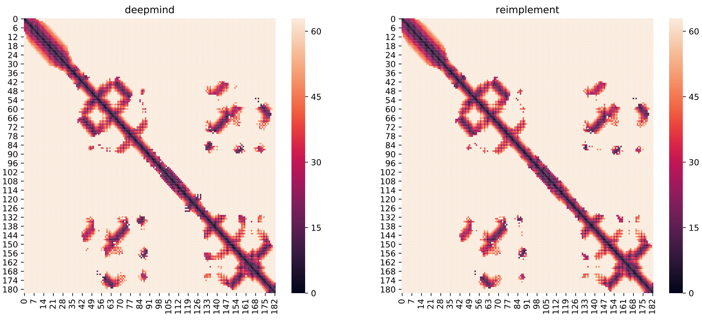

<center><h1>AlphaFold1预处理</h1></center>

<center>李盼 2021-04-15</center><br>

### 1. 相关的Linux程序

确保必要的Linux程序在`PATH`中：

```shell
# Matlab
export PATH=/Share2/home/zhangqf/usr/MATLAB/R2015b/bin2/matlab:$PATH
# hhsuite
export PATH=/Share/home/zhangqf/lipan/usr/hhsuite-3.3.0-AVX2-Linux/bin:$PATH
export PATH=/Share/home/zhangqf/lipan/usr/hhsuite-3.3.0-AVX2-Linux/scripts:$PATH
# psiblast
export PATH=/Share/home/zhangqf/lipan/usr/ncbi-blast-2.11.0+-src/blast/bin:$PATH
# chkparse
export PATH=/Share2/home/zhangqf/lipan/usr/Bin:$PATH
```

在shell中输入`matlab -h`、`hhblits -h`、`psiblast -h`、`chkparse`，检查是否都可以执行。如果报错了，可以把下面的库加入`LD_LIBRARY_PATH`下：

```shell
export LD_LIBRARY_PATH=/Share/home/zhangqf/lipan/usr/anaconda3/lib:$LD_LIBRARY_PATH
```

### 2. Python相关的包

把`AlphaFold.py`引入`PYTHONPATH`中：

```shell
export PYTHONPATH=/Share/home/zhangqf/lipan/usr/IPyRSSA:$PYTHONPATH
# 如没有本地的Python3，可以使用我配置的Python3
source /Share/home/zhangqf/lipan/Load_Env/load_anaconda3.sh # Optional
```

### 3. 执行预处理步骤

以`T0949-l64_s64`为例作为输入，把下面的序列命名成`input.fa`。

```
>T0949-l64_s64
VGEKVELTIDNRSQSAPPIAHQFSIGRTLVSRDNGFPKSQAIAVGWKDNFFDGVPITSGGQTGP
```

打开<mark>python3</mark>：

```python
import AlphaFold

AlphaFold.run_alphafold1_input_pipeline(query_fasta='input.fa', 
                  outdir='output', 
                  cpu=10, # hhblits和 psiblast占用的cpu数
                  verbose=True, # 是否在屏幕上显示shell命令
                  noExecute=False,  # 如果为True，就只打印shell命令，但不执行
                  use_LSF=True,  # 为True表示使用LSF，否则在ZIO01上执行
                  LSF_parameters={ 'queue': 'Z-ZQF', 
                                  'cpu': 10,
                                  'logFn': 'output/log', 
                                  'errFn': 'output/err'  })

exit()
```

Matlab默认使用12个核，而且Matlab无法提交到集群执行，因为License会报错。上面的函数执行完成以后，会生成下面的文件：

```
# 这几个都是hhblits在正常参数下生成的多序列比对文件，只是格式不同而已
hhblits.a3m
hhblits.fas
hhblits.psi
# 这是hhblits生成的HMM文件
hhblits.hmm
# 这是hhblits加上-nocontxt参数下生成的多序列比对文件
hhblits_prior.psi
# Potts model数据
matlab.mat
# PSI-BLAST的Profile
chkparse.out
```

### 4. 读取输出

下面的Python3代码把上面的数据读取到Python中：

```python
import AlphaFold, General

hhblits_psi_file = 'output/hhblits.psi'
hhblits_prior_psi_file = 'output/hhblits_prior.psi'
hmm_file = 'output/hhblits.hmm'
chkparse_file = 'output/chkparse.out'
matlab_file = 'output/matlab.mat'
hhblits_a3m_file = 'output/hhblits.a3m'
query_seq = list(General.load_fasta('input.fa').values())[0] 
# 序列，也可以写成："VGEKVELTIDNRSQSAPPIAHQFSIGRTLVSRDNGFPKSQAIAVGWKDNFFDGVPITSGGQTGP"

# 读取数据
instance = AlphaFold.read_data_array_from_file(hhblits_psi_file, hhblits_prior_psi_file, 
                                    hmm_file, chkparse_file, matlab_file, hhblits_a3m_file, query_seq)

print(type(instance)) # <class 'AlphaFold.Input'>, 这是一个namedtuple对象

# 展示数据以及维度
features = ['aatype', 'deletion_probability', 'gap_matrix', 'hhblits_prior_profile', 'hhblits_profile', 'hmm_profile', 'non_gapped_prior_profile', 'non_gapped_profile', 'num_alignments', 'profile', 'pseudo_bias', 'pseudolikelihood', 'pseudolikelihood_frob', 'residue_index', 'reweighted_profile']
for feature in features:
  	print( feature, getattr(instance, feature).shape )
```

氨基酸的个数是64：

```
aatype (1, 64, 21)
deletion_probability (1, 64, 1)
gap_matrix (1, 64, 64, 1)
hhblits_prior_profile (1, 64, 22)
hhblits_profile (1, 64, 22)
hmm_profile (1, 64, 30)
non_gapped_prior_profile (1, 64, 21)
non_gapped_profile (1, 64, 21)
num_alignments (1, 64, 1)
profile (1, 64, 21)
pseudo_bias (1, 64, 22)
pseudolikelihood (1, 64, 64, 484)
pseudolikelihood_frob (1, 64, 64, 1)
residue_index (1, 64, 1)
reweighted_profile (1, 64, 22)
```

### 5. 存储为tfrec文件

```python
import tensorflow as tf
if tf.__version__[0] == '2':
  import tensorflow.compat.v1 as tf

feature_parse = AlphaFold.package_as_DM_AlphaFold_input(instance, 
                                        chain_name='T0949',
                                        domain_name='T0949-l64_s64',
                                        query_seq=query_seq)

# 然后存储为tfrec文件
example = tf.train.Example(features=tf.train.Features( feature=feature_parse ))
writer = tf.python_io.TFRecordWriter('output.tfrec')
writer.write(example.SerializeToString())
writer.close()
```

该`.tfrec`文件可以作为DeepMind AlphaFold的输入文件。

下面是使用我预处理的特征和DeepMind预处理的特征比较的结果：



