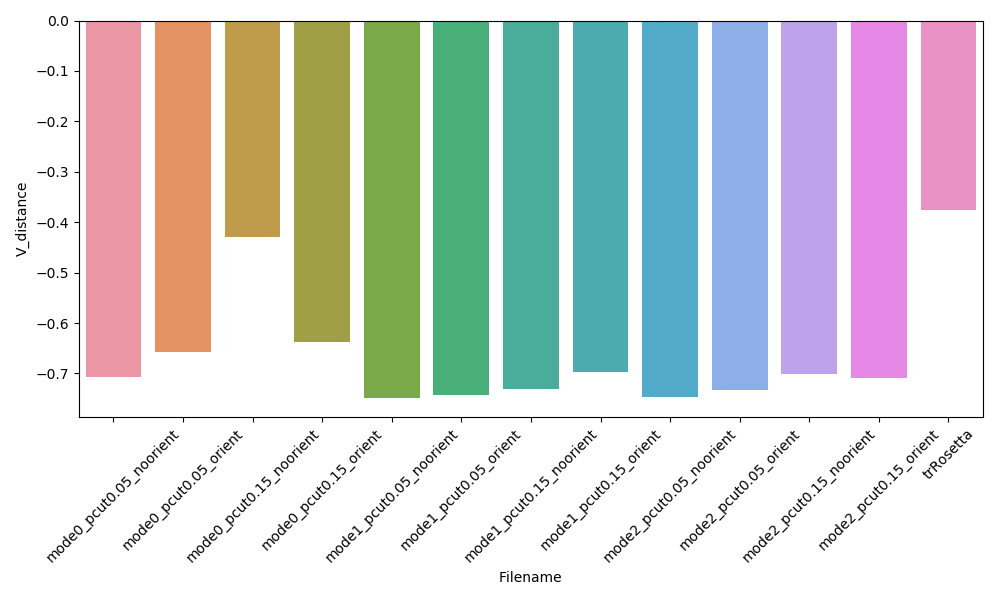

<center><h1>结合AlphaFold1的输出和trRosetta后处理的方法预测蛋白质结构</h1></center>

> trRosetta的[文献](https://doi.org/10.1073/pnas.1914677117)，在线[服务器](https://yanglab.nankai.edu.cn/trRosetta/)，[Github](https://github.com/gjoni/trRosetta)。

### 1. trRosetta方法简介

#### 1.1 输入

和AlphaFold1类似，trRosetta的输入也是一个多序列比对。trRosetta使用下面的方法对MSA进行预处理，首先提取单位点和双位点的频率特征：

* 单位点：

$$
f_i(A)=\frac{1}{M_{eff}}\sum_{m=1}^{M}w_m\delta _{A,A_m}
$$

* 双位点：

$$
f_{i,j}(A,B)=\frac{1}{M_{eff}}\sum_{m=1}^{M}w_m\delta _{A,A_{i,m}}\delta _{B,A_{j,m}}
$$

下面是符号的解释：

* $A,B$表示氨基酸类型（20种氨基酸+gap）

* $\delta$是Kronecker delta，即两个氨基酸相同时为1、否则为0
* $i,j$表示比对列
* $m$表示序列号，$M$是序列数量
* $w_m$：1/和序列$m$相似性高于80%的序列的数量
* $M_{eff}=\sum_{m=1}^{M}w_m$

计算多序列比对的共变矩阵：
$$
C_{i,j}^{A,B}=f_{i,j}(A,B)-f_i(A)f_j(B)
$$
shrinkage以后，计算该矩阵的逆，其中权重4.5是经过调整得到的：
$$
s_{i,j}^{A,B}=(C_{i,j}^{A,B}+\frac{4.5}{\sqrt{M_{eff}}}\delta_{i,j}\delta_{A,B})^{-1}
$$
上面的$21 \times 21$的矩阵经过flatten以后得到一个$L \times L \times 441$的矩阵。同时还计算一个average product correction (APC)过的Frobenius norm：
$$
s_{i,j}^*=\sqrt{\sum_{A=1}^{20}\sum_{B=1}^{20}(s_{i,j}^{A,B})^2}
$$

$$
s_{i,j}=s_{i,j}^*-s_{.,j}^*s_{i,.}^*/s_{.,.}^*
$$

其中$s_{i,.}=\frac{1}{L}\sum_{j=1}^{L}s_{i,j}$

整个模型的输入组成：

* 序列的One-hot编码：20个channels
* 位点特异性频率矩阵：20个氨基酸+1 gap
* 位点熵：1 feature
* 上面的42个特征和垂直和水平的tile，因此变成84维
* MSA中有441个特征和1一个APC特征
* 因此，总的特征数为526，输入是一个$L \times L \times 526$维的矩阵

#### 1.2 模型结构和预测目标

模型的结构如下所示：


由61个堆叠的残基块组成，最后一个残基块输入为四个独立的值：

* $d$是残基之间相互作用的距离，从2-20Å分成了36个bin，每一个bin占0.5Å，第一个bin表示not contact；
* $\theta$是N-CA-CB-CB之间的torsion，是一个不对称的矩阵，取值范围是$[-\pi,\pi]$，分为24个bin，第一个bin表示not contact；
* $\psi$是是CA-CB-CB之间的angle，是一个不对称的矩阵，取值范围是$[0,\pi]$，分为12个bin，第一个bin表示not contact；
* $\omega$是CA-CB-CB-CA之间的torsion，是一个对称的矩阵，取值范围是$[-\pi,\pi]$，分为24个bin，第一个bin表示not contact；

在训练的过程中，四个量的权重是相等的。长于300-aa的氨基酸随机的切割成300-aa。训练5个模型，取它们的均值作为最终的预测值。

#### 1.3 trRosetta后处理

trRosetta以前面的DL模型的输出作为后处理的输入，过程如下所示：


后处理的主要思想是使用预测Distogram和三种角度作为Constraint，结合Rosetta预测蛋白的三维结构。DL模型的输出维度为：

* $d \in R^{L \times L \times 36}$
* $\theta \in R^{L \times L \times 24}$
* $\omega \in R^{L \times L \times 12}$
* $\psi \in R^{L \times L \times 24}$

为了把这些值转换成Rosetta的限制参数，使用下面的式子对Distogram进行预处理：
$$
score^d(i)=-ln(p_i)+ln((\frac{d_i}{d_N})^\alpha p_N), i=1,2,...,N
$$
其中$p_i$表示两个残基之间第$i$个bin的概率，$p_N$表示最后一个bin的概率，注意这里不包括第一个bin，因为它表示not contact的概率。$d_i$表示第$i$个bin所表示的距离，$d_N$是最后一个bin的距离，为19.75。$(\frac{d_i}{d_N})^\alpha$是归一化项，$\alpha$是一个常数（=1.57）。

角度值的转换为下面所示，不包含归一化项：
$$
score^{o}(i)=-ln(p_i)+ln(p_N), i=1,2,...,N
$$
建模的方法是：首先通过基于quasi–Newton的能量最小化（MinMover）方法获得粗粒度的centroid结构模型，centroid结构只包含蛋白质的主链，侧链被表示成单个原子（叫做centroid）。使用L-BFGS算法（lbfgs_armijo_nonmonotone）进行优化，允许最大的迭代次数为1000次，拟合的阈值为0.0001。同时还结合其他的Rosetta能量项：ramachandran (rama)、the omega and the steric repulsion van der Waals forces (vdw)、the centroid backbone hydrogen bonding (cen_hb)。$d、\theta、\omega、\psi$被当做约束条件整合到模型中。

```python
sf = ScoreFunction()
# 加载参数
# cen_hb  5.0
# rama    1.0
# omega   0.5
# vdw     1.0
# atom_pair_constraint  5
# dihedral_constraint   4
# angle_constraint      4
sf.add_weights_from_file(scriptdir + '/data/scorefxn.wts')
min_mover = MinMover(mmap, sf, 'lbfgs_armijo_nonmonotone', 0.0001, True)
min_mover.max_iter(1000)
repeat_mover = RepeatMover(min_mover, 3)
...
# 给pose添加约束
add_rst(pose, rst, 1, 12, params)
repeat_mover.apply(pose) # 使用上面定义的打分项进行优化
```

MinMover程序是随机的，可能会陷入局部最优，因此采取两种策略来避免局部最优：

* 使用不用的起始结构（尝试产生10个随机的起始结构）

  ```python
  pose = pose_from_sequence(seq, 'centroid' ) # centroid
  # 给每一个残基设置随机的phi和psi
  set_random_dihedral(pose)
  ```

* 使用不同的约束：只保留所有数据中概率大于某个特定阈值作为约束（从0.05到0.5，步长为0.1）

  ```python
  array += [line for a,b,p,line in rst['dist'] if abs(a-b)>=sep1 and abs(a-b)<sep2 and p>=pcut]
  ```

  对于每一个起始结构，通过选择不同约束子集来产生三种模型：short range (1 ≤ s < 12), medium range (12 ≤ s < 24), and long range (s ≥ 24)

  * 连续short-, medium-和long-range

    ```python
    # short
    add_rst(pose, rst, 1, 12, params)
    repeat_mover.apply(pose)
    min_mover_cart.apply(pose)
    remove_clash(sf_vdw, min_mover1, pose)
    
    # medium
    add_rst(pose, rst, 12, 24, params)
    repeat_mover.apply(pose)
    min_mover_cart.apply(pose)
    remove_clash(sf_vdw, min_mover1, pose)
    
    # long
    add_rst(pose, rst, 24, len(seq), params)
    repeat_mover.apply(pose)
    min_mover_cart.apply(pose)
    remove_clash(sf_vdw, min_mover1, pose)
    ```

  * short- + medium-range restraints and then with long-range restraints

    ```python
    # short + medium
    add_rst(pose, rst, 3, 24, params)
    repeat_mover.apply(pose)
    min_mover_cart.apply(pose)
    remove_clash(sf_vdw, min_mover1, pose)
    
    # long
    add_rst(pose, rst, 24, len(seq), params)
    repeat_mover.apply(pose)
    min_mover_cart.apply(pose)
    remove_clash(sf_vdw, min_mover1, pose)
    ```

  * using all restraints together

    ```python
    # short + medium + long
    add_rst(  pose, rst, 1, len(seq), params)
    repeat_mover.apply(pose)
    min_mover_cart.apply(pose)
    remove_clash(sf_vdw, min_mover1, pose)
    ```

每一个蛋白质最后产生150（$=10 \times 5 \times 3$）个centroid结构模型，根据能量排序的前十个结构模型被选择进行FastRelax，并使用contact概率大于0.15的$d、\theta、\omega、\psi$作为约束来调整结构。

### 2. 使用AlphaFold1的输出来进行后处理

AlphaFold1的主要输出为：

* Distogram $\in R^{L \times L \times 64}$
* Torsion angles $\in R^{L \times L \times 36}$

对应三个文件：

* T0949.pickle：`pasted/T0949.pickle`，是AlphaFold预测的Distogram
* T0949_bg.pickle：`background_distogram/ensemble/T0949.pickle`，是AlphaFold backgroud model预测的Distogram
* T0949.torsions：是AlphaFold预测的torsion分布

为了用AlphaFold输出的Distogram和Torsion作为约束来预测蛋白质的三级结构，把dist和torsion转换成分数，使用MinMover的预测蛋白质的结构，为了测试不同的条件，使用如下的代码生成$2 \times 3 \times 2=12$个模型。

```shell
PCUT=(0.05 0.15)
modes=(0 1 2)

# 分别测试不用阈值
for mode in ${modes[@]}; do
    for pcut in ${PCUT[@]}; do
        python trRosetta_AlphaFold_constrait.py -m $mode \
        	T0949.pickle T0949.torsions models/T0949_mode${mode}_pcut${pcut}_orient &
        python trRosetta_AlphaFold_constrait.py -m $mode --no-orient \
        	T0949.pickle T0949.torsions models/T0949_mode${mode}_pcut${pcut}_noorient &
    done
done
```

然后分别对每一个输出的模型统计AlphaFold的以下三项指标：

* $V_{distance}(x)=-\sum_{i,j,i \ne j}logP(d_{ij}|S,MSA(S))-logP(d_{ij}|length,\delta_{\alpha\beta})$

* $V_{torsion}(\phi,\psi)=-\sum_{i}logp_{vonMises}(\phi_i,\psi_i|S, MSA(S))$
* $V_{score2\_smooth}$：使用PyRosetta计算

```bash
for file in $(ls models/*_Refined.pdb);
do
    echo $file
    python Calc_Potention.py $file
done
# trRosetta.pdb是trRosetta网络服务器生成的结构模型
python Calc_Potention.py models/trRosetta.pdb
```

下面是结果，注意都是越小越好。





对比下面的结果：

##### trRosetta


##### mode1_pcut0.05_orient


##### mode2_pcut0.05_orient

