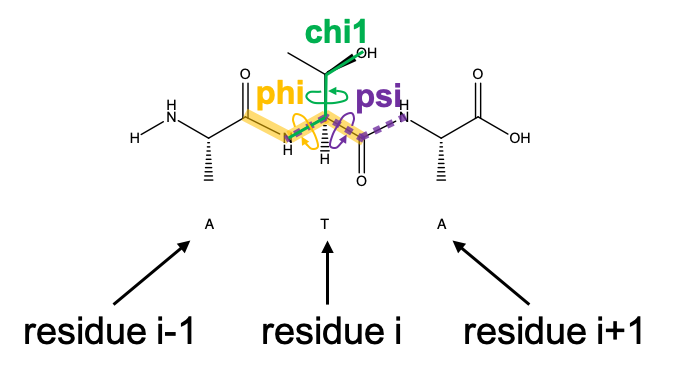

```python
from pyrosetta import *
init()

# 读取一个PDB文件
pose = pose_from_pdb( '5tj3.pdb' )

# 获得序列
pose.sequence()
```

只留下PDB里面的Atom行，生成`5tj3.clean.pdb`文件：

```python
from pyrosetta.toolbox import cleanATOM
cleanATOM("5tj3.pdb")
```

```python
pose_clean = pose_from_pdb("5tj3.clean.pdb")
# 现在的sequence和上面的不一样了
pose_clean.sequence()

# 看更多细节
pose.annotated_sequence()
'N[ASN:NtermProteinFull]AVPRP....VIG[GLY:CtermProteinFull]Z[ZN]Z[ZN]Z[ZN]Z[ZN]'
# 后面的Z[ZN]是锌离子
pose_clean.annotated_sequence()
'N[ASN:NtermProteinFull]AVPRP....VIG[GLY:CtermProteinFull]'
```

```python
# 输出残基的数量
print(pose.total_residue()) # 524
print(pose_clean.total_residue()) # 519

# 取出第20个氨基酸，从1开始
residue20 =  pose.residue(20)
print(residue20.name())

residue24 = pose.residue(24)
pose.pdb_info().chain(24) # 查看第24个残基位于哪条chain

# 查看第一个残基对应全序列的序列
print(pose.pdb_info().number(1)) # 24
# ATOM      1  N   ASN A  24      25.188 -20.017  58.979  1.00 36.24           N  

# 查看A chain第24位对应.sequence()第几位，pdb号码 => sequence pos
print(pose.pdb_info().pdb2pose('A', 24)) # 1

# 获得第24位残基，并输出名字和性质
res_24 = pose.residue(24)
print(res_24.name()) # ARG
print(res_24.is_charged()) # True
```

锌离子

```python
zn_resid = pose.pdb_info().pdb2pose('A', 601)
res_zn = pose.residue(zn_resid) 
res_zn.is_metal()
```

判断原子性质

```python
# 判断是否是一个骨架原子
res_24.atom_is_backbone(res_24.atom_index("CA"))
```

### 获得角度和键长

```python
from pyrosetta import *
init()

pose = pose_from_pdb("5tj3.pdb")
resid = pose.pdb_info().pdb2pose('A', 28)

print("phi:", pose.phi(resid))
print("psi:", pose.psi(resid))
print("chi1:", pose.chi(1, resid)) # Chi1是其中一个角度
```



```python
conformation = pose.conformation()
print(resid) # 5
res_28 = pose.residue(resid)
N28 = AtomID(res_28.atom_index("N"), resid) # pyrosetta.rosetta.core.id.AtomID对象
CA28 = AtomID(res_28.atom_index("CA"), resid)
C28 = AtomID(res_28.atom_index("C"), resid)
print(N28) # atomno= 1 rsd= 5 
print(C28) # atomno= 3 rsd= 5 
print(CA28) # atomno= 2 rsd= 5 

# 获得两个原子之间的距离
print(pose.conformation().bond_length(N28, CA28)) # 1.456100614655453
print(pose.conformation().bond_length(CA28, C28)) # 1.5184027792387658

# 另外一种方法
# res_28.atom('N').xyz() 
# pyrosetta.rosetta.numeric.xyzVector_double_t对象
# res_28.atom('N')
# pyrosetta.rosetta.core.conformation.Atom对象
N28_xyz = res_28.atom('N').xyz() 
CA28_xyz = res_28.atom('CA').xyz()
C28_xyz = res_28.atom('C').xyz()

print(N28_xyz.distance(CA28_xyz)) # 1.456100614655453
print(CA28_xyz.distance(C28_xyz)) # 1.5184027792387658
```

统计分布：

```python
# 三种Torsion的分布
omega = []
phi = []
psi = []
for i in range(1, 520):
  omega.append( pose.omega(i) )
  phi.append( pose.phi(i) )
  psi.append( pose.psi(i) )

sns.swarmplot(omega)
plt.scatter(phi, psi)
plt.xlabel('Phi')
plt.ylabel('Psi')
plt.show()

# 键长的分布
N_CA = []
CA_C = []
for i in range(1, 520):
    res = pose.residue(i)
    N_xyz = res.atom('N').xyz() 
    CA_xyz = res.atom('CA').xyz()
    C_xyz = res.atom('C').xyz()
    N_CA.append(N_xyz.distance(CA_xyz)) # 1.456100614655453
    CA_C.append(CA_xyz.distance(C_xyz)) # 1.5184027792387658

plt.figure(figsize=(12,5))
plt.subplot(1,2,1)
sns.distplot(N_CA, kde=False)
plt.title("Dist(N-CA)")
plt.subplot(1,2,2)
sns.distplot(CA_C, kde=False)
plt.title("Dist(CA-C)")
plt.show()
```

PyRosetta的Database所在目录为：`/Users/lee/anaconda3/lib/python3.7/site-packages/pyrosetta/database`。其中`chemical/residue_type_sets/fa_standard/residue_types`目录下记录了一些标准残基的参数。比如`l-caa/CYS.params`记录了CYS的参数：

```
# torsion angles, bond angles, and bond lengths between subsequent atoms in this residue
ICOOR_INTERNAL    N      0.000000    0.000000    0.000000   N     CA    C  
ICOOR_INTERNAL    CA     0.000000  180.000000    1.458001   N     CA    C  
ICOOR_INTERNAL    C      0.000000   68.800003    1.523258   CA    N     C  
ICOOR_INTERNAL  UPPER  150.000000   63.800018    1.328685   C     CA    N  
ICOOR_INTERNAL    O    180.000000   59.200008    1.231015   C     CA  UPPER
ICOOR_INTERNAL    CB  -121.600000   69.400000    1.528861   CA    N     C  
ICOOR_INTERNAL    SG     0.000000   65.900000    1.808803   CB    CA    N  
ICOOR_INTERNAL    HG  -180.000000   84.011803    1.329369   SG    CB    CA 
ICOOR_INTERNAL   1HB   121.200000   70.500000    1.090249   CB    CA    SG 
ICOOR_INTERNAL   2HB   117.600000   70.500000    1.089821   CB    CA   1HB 
ICOOR_INTERNAL    HA  -119.000000   71.500000    1.090059   CA    N     CB 
ICOOR_INTERNAL  LOWER -150.000000   58.299995    1.328685   N     CA    C  
ICOOR_INTERNAL    H    180.000000   60.849998    1.010000   N     CA  LOWER
```

理想情况下，C-CA的距离为1.523Å，CA-N的距离为1.458Å。

```shell
cd /Users/lee/anaconda3/lib/python3.7/site-packages/pyrosetta/database/chemical/residue_type_sets/fa_standard/residue_types/l-caa
grep "ICOOR_INTERNAL    CA" *
grep "ICOOR_INTERNAL    C " *
```

创建一个理想结构的蛋白：

```python
one_res_seq = "V"
pose_one_res = pose_from_sequence(one_res_seq)
print(pose_one_res.sequence())

N_xyz = pose_one_res.residue(1).xyz("N")
CA_xyz = pose_one_res.residue(1).xyz("CA")
C_xyz = pose_one_res.residue(1).xyz("C")
print((CA_xyz - N_xyz).norm()) # 1.458004
print((CA_xyz - C_xyz).norm()) # 1.52326
```

夹角:

```python
angle = pose.conformation().bond_angle(N28, CA28, C28)
print(angle) # 1.913188766577386
import math
angle*180/math.pi # 109.6176417367238

angle = []
for i in range(1,520):
    res = pose.residue(i)
    N = AtomID( res.atom_index('N'),  i)
    CA = AtomID( res.atom_index('CA'),  i)
    C = AtomID( res.atom_index('C'),  i)
    angle.append( pose.conformation().bond_angle(N, CA, C) )

sns.displot(angle, kde=False)
plt.show()
```

根据三维坐标计算夹角，计算BA和BC之间的夹角为：$arccos(\frac{BA \cdot BC}{|BA| \cdot |BC|})$。

```python
N28_xyz = res_28.atom('N').xyz() 
CA28_xyz = res_28.atom('CA').xyz()
C28_xyz = res_28.atom('C').xyz()

BA = N28_xyz - CA28_xyz
BC = C28_xyz - CA28_xyz
np.arccos( BA.dot(BC) / ( BA.norm() * BC.norm() ) ) # 1.913188766577386
```

设置phi和psi：

```python
tripeptide = pose_from_sequence("AAA")

orig_phi = tripeptide.phi(2)
orig_psi = tripeptide.psi(2)
print("original phi:", orig_phi)
print("original psi:", orig_psi)

print("xyz coordinates:", tripeptide.residue(2).xyz("CB"))
# xyz coordinates:       3.535270304899897       3.659035776744378       1.199094204197625

tripeptide.set_phi(2, -60)
tripeptide.set_psi(2, -43)

print("xyz coordinates:", tripeptide.residue(2).xyz("CB"))
# xyz coordinates:       5.498535447297188       2.671616235800968     0.06968570437453583
```

### Scoring

```python
import Bio.PDB.PDBList
pdbfile = Bio.PDB.PDBList().retrieve_pdb_file(pdb_code="6Q21", pdir="/tmp") # /tmp/6q21.cif

# 首先要Clean PDB，并且只保留其中一条链
# pyrosetta.toolbox.cleanATOM(pdbfile, '/tmp/6q21.clean.pdb')

scorefxn = get_fa_scorefxn()
print(scorefxn) # 查看所有的参数
type(scorefxn) # <class 'pyrosetta.rosetta.core.scoring.ScoreFunction'>
```

会输出一些信息：

```
weights: (fa_atr 1) (fa_rep 0.55) (fa_sol 1) (fa_intra_rep 0.005) (fa_intra_sol_xover4 1) (lk_ball_wtd 1) (fa_elec 1) (pro_close 1.25) (hbond_sr_bb 1) (hbond_lr_bb 1) (hbond_bb_sc 1) (hbond_sc 1) (dslf_fa13 1.25) (omega 0.4) (fa_dun 0.7) (p_aa_pp 0.6) (yhh_planarity 0.625) (ref 1) (rama_prepro 0.45)
...
EnergyMethodOptions::show: method_weights: ref 1.32468 3.25479 -2.14574 -2.72453 1.21829 0.79816 -0.30065 2.30374 -0.71458 1.66147 1.65735 -1.34026 -1.64321 -1.45095 -0.09474 -0.28969 1.15175 2.64269 2.26099 0.58223
...
HBondOptions::show: params_database_tag_: ref2015_params
```

[文件](https://graylab.jhu.edu/pyrosetta/downloads/documentation/PyRosetta_Workshops_Appendix_A.pdf)中记录了Rosetta中的一些打分项。

| 缩写                                              | 适用   | 解释                                                         |
| ------------------------------------------------- | ------ | ------------------------------------------------------------ |
| fa_atr                                            | FA     | van der Waals net attractive energy                          |
| fa_rep                                            | FA     | van der Waals net repulsive energy                           |
| hbond_sr_bb, hbond_lr_bb                          | FA/CEN | Hydrogen-bonding energies, short and long-range, backbone–backbone |
| fa_sol                                            | FA     | Solvation energies (Lazaridis–Karplus)                       |
| fa_dun                                            | FA     | Dunbrack rotamer probability                                 |
| fa_pair                                           | FA     | Statistical residue–residue pair potential                   |
| fa_intra_rep                                      | FA     | Intraresidue repulsive Van der Waals energy                  |
| fa_elec                                           | FA     | Distance-dependent dielectric electrostatics                 |
| pro_close                                         | FA     | Proline ring closing energy                                  |
| dslf_ss_dst, dslf_cs_ang,dslf_ss_dih, dslf_ca_dih | FA     | Disulfide statistical energies (S–S distance, etc.)          |
| ref                                               | FA/CEN | Amino acid reference energy of unfolded state                |
| p_aa_pp                                           | FA/CEN | Propensity of amino acid in (φ,ψ) bin, P(aa\|φ,ψ)            |
| rama                                              | FA/CEN | Ramachandran propensities                                    |
| vdw                                               | CEN    | van der Waals “bumps” (repulsive only)                       |
| env                                               | CEN    | Residue environment score (statistical)                      |
| Pair                                              | CEN    | Residue–residue pair score (statistical)                     |
| cbeta                                             | CEN    | β-carbon score                                               |

#### Custom score function

自定义的打分函数只包含van der Waals, solvation, and  hydrogen bonding terms。

```python
scorefxn2 = ScoreFunction()
scorefxn2.set_weight(pyrosetta.rosetta.core.scoring.ScoreType.fa_atr, 1.0)
# van der Waals net attractive energy
scorefxn2.set_weight(pyrosetta.rosetta.core.scoring.ScoreType.fa_rep, 1.0)
# van der Waals net repulsive energy
print(scorefxn2)
# weights: (fa_atr 1) (fa_rep 1)
```

#### 评价PDB

```python
ras = pyrosetta.pose_from_pdb(pdbfile)
ras.num_chains() # 8

ras1 = ras.split_by_chain(1)
print( len(ras1) ) # 172

# 评价蛋白
print( scorefxn(ras1) ) # 1208.9077245185017
scorefxn.show(ras)
```

```
core.scoring.ScoreFunction: 
------------------------------------------------------------
 Scores                       Weight   Raw Score Wghtd.Score
------------------------------------------------------------
 fa_atr                       1.000   -4465.653   -4465.653 van der Waals net attractive energy
 fa_rep                       0.550    4531.534    2492.343 van der Waals net repulsive energy
 fa_sol                       1.000    3153.321    3153.321 Solvation energies (Lazaridis–Karplus)
 fa_intra_rep                 0.005    3064.638      15.323
 fa_intra_sol_xover4          1.000     200.904     200.904
 lk_ball_wtd                  1.000     -54.711     -54.711
 fa_elec                      1.000   -1083.192   -1083.192 Distance-dependent dielectric electrostatics
 pro_close                    1.250     270.565     338.206
 hbond_sr_bb                  1.000    -181.224    -181.224
 hbond_lr_bb                  1.000    -130.586    -130.586
 hbond_bb_sc                  1.000     -73.431     -73.431
 hbond_sc                     1.000     -53.769     -53.769
 dslf_fa13                    1.250       0.000       0.000
 omega                        0.400     149.145      59.658
 fa_dun                       0.700    4635.733    3245.013 Dunbrack rotamer probability
 p_aa_pp                      0.600    -101.427     -60.856
 yhh_planarity                0.625       0.000       0.000
 ref                          1.000     188.455     188.455
 rama_prepro                  0.450     591.830     266.324
---------------------------------------------------
 Total weighted score:                     3856.128
```

显示unweighted energies：

```python
ras1.energies().show()
ras1.energies().show(n) # 显示第n个残基的能量
# core.scoring.Energies: E               fa_atr        fa_rep        fa_sol  fa_intra_repfa_intra_sol_x   lk_ball_wtd       fa_elec     pro_close   hbond_sr_bb   hbond_lr_bb   hbond_bb_sc      hbond_sc     dslf_fa13         omega        fa_dun       p_aa_pp yhh_planarity           ref   rama_prepro
# core.scoring.Energies: E(i)   2         -5.10          1.82          4.05          0.83          0.04          0.04         -1.67          0.00          0.00          0.00          0.00          0.00          0.00          0.00          4.52         -0.34          0.00          1.15          0.09
```

范德华力和solvation都是原子-原子相互作用力，可以通过查表获得，与原子类型和距离相关：

```python
r1 = ras1.residue(24)
r2 = ras1.residue(20)
pyrosetta.etable_atom_pair_energies(r1, r1.atom_index('N'), r2, r2.atom_index('O'), scorefxn)
# lj_atr, lj_rep, fa_solv, and fa_elec potentials
# (-0.1505855046001568, 0.0, 0.5903452111877214, 2.173111777247698)
```

氢键

```python
hbond_set = pyrosetta.rosetta.core.scoring.hbonds.HBondSet()
ras1.update_residue_neighbors()
pyrosetta.rosetta.core.scoring.hbonds.fill_hbond_set(ras1, False, hbond_set)
hbond_set.show(ras1, n) # n表示某个残基
```

```
core.scoring.hbonds.HBondSet: #Dch Dn Dres Da  Ach An Ares Aa  length AHDang BAHang  BAtor weight energy
core.scoring.hbonds.HBondSet: #A    2  THR  N  A   50  THR  O    2.01  158.3  155.0 -175.7  1.000 -1.342
core.scoring.hbonds.HBondSet: #A   52  LEU  N  A    2  THR  O    1.59  171.0  149.6  134.7  1.000 -0.439
core.scoring.hbonds.HBondSet: #A    4  TYR  N  A   52  LEU  O    1.71  146.0  157.4  151.1  1.000 -0.468
...
```

存储分数：

```python
emap = pyrosetta.rosetta.core.scoring.EMapVector()
scorefxn.eval_ci_2b(ras.residue(102), ras.residue(104), ras, emap)
print(emap)
print( emap[pyrosetta.rosetta.core.scoring.ScoreType.fa_atr] )
```


