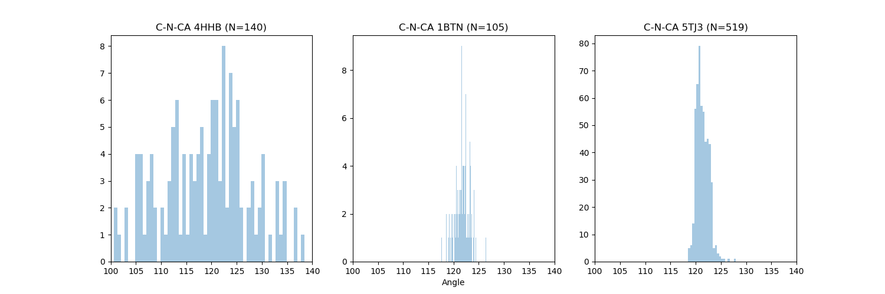

<center><h1>蛋白质结构分析</h1></center>

<center>李盼 2021-04-20</center><br>

> 本文主要来探索蛋白质结构中的各种属性

一个典型的蛋白质结构模型如下所示，其中存在许多相对变化幅度不大的键长和键角，下面分别对每种键长、键角和torsion angle进行一些统计分析。本分析选取的例子为：`4HHB、1BTN、5TJ3`。


### 准备数据

```python
import Bio.PDB
import pyrosetta

Bio.PDB.PDBList().retrieve_pdb_file("4HHB", pdir='/tmp/')
Bio.PDB.PDBList().retrieve_pdb_file("1BTN", pdir='/tmp/')
Bio.PDB.PDBList().retrieve_pdb_file("5TJ3", pdir='/tmp/')

pyrosetta.init()
pose1 = pyrosetta.pose_from_file('/tmp/4hhb.cif')
pose2 = pyrosetta.pose_from_file('/tmp/1btn.cif')
pose3 = pyrosetta.pose_from_file('/tmp/5tj3.cif')

print( pose1.num_chains() ) # 10
print( pose2.num_chains() ) # 2
print( pose3.num_chains() ) # 1
```

### 读取相关的数据

```python
def collection_protein_information(pose):
    N_CA = []
    CA_C = []
    C_N = []
    C_O = []
    N_CA_C = []
    CA_C_N = []
    C_N_CA = []
    phi = []
    psi = []
    omega = []
    chi1 = []
    for i in range(1, 99999):
        if 'CtermProteinFull' in pose.residue(i).name():
            break
        ### Torsion
        phi.append( pose.phi(i) )
        psi.append( pose.psi(i) )
        omega.append( pose.omega(i) )
        if pose.residue(i).name() not in ('GLY', 'ALA'):
            chi1.append( pose.chi(1,i) )
        else:
            chi1.append( np.nan )
        ### Atoms
        N = pose.residue(i).atom("N")
        C = pose.residue(i).atom("C")
        CA = pose.residue(i).atom("CA")
        O = pose.residue(i).atom("O")
        ### Bond length
        N_CA.append( N.xyz().distance( CA.xyz() ) )
        CA_C.append( CA.xyz().distance( C.xyz() ) )
        C_O.append( C.xyz().distance( O.xyz() ) )
        N_next = pose.residue(i+1).atom("N")
        C_N.append( C.xyz().distance( N_next.xyz() ) )
        ### Angle
        N_CA_C.append( angle(N.xyz(), CA.xyz(), C.xyz()) )
        N_next = pose.residue(i+1).atom("N")
        CA_next = pose.residue(i+1).atom("CA")
        CA_C_N.append( angle(CA.xyz(), C.xyz(), N_next.xyz()) )
        C_N_CA.append( angle(C.xyz(), N_next.xyz(), CA_next.xyz()) )
    N_CA = np.array( N_CA )
    CA_C = np.array( CA_C )
    C_N = np.array( C_N )
    C_O = np.array( C_O )
    N_CA_C = np.array( N_CA_C )
    CA_C_N = np.array( CA_C_N )
    C_N_CA = np.array( C_N_CA )
    phi = np.array( phi )
    psi = np.array( psi )
    omega = np.array( omega )
    chi1 = np.array( chi1 )
    return ProteinInfo(N_CA, CA_C, C_N, C_O, \
        N_CA_C, CA_C_N, C_N_CA, \
        phi, psi, omega, chi1)

Pinfo1 = collection_protein_information(pose1)
Pinfo2 = collection_protein_information(pose2)
Pinfo3 = collection_protein_information(pose3)
```

### 相关的统计

```python
def distplot( data1, data2, data3, xlim=None, title='', xlabel=None ):
    data1 = data1[~np.isnan(data1)]
    data2 = data2[~np.isnan(data2)]
    data3 = data3[~np.isnan(data3)]
    
    plt.figure(figsize=(15,5))
    plt.subplot(1,3,1)
    sns.distplot( data1, kde=False, bins=80 )
    if xlim: plt.xlim(*xlim)
    plt.title(title+f" 4HHB (N={len(data1)})")
    plt.subplot(1,3,2)
    sns.distplot( data2, kde=False, bins=80 )
    if xlim: plt.xlim(*xlim)
    if xlabel: plt.xlabel(xlabel)
    plt.title(title+f" 1BTN (N={len(data2)})")
    plt.subplot(1,3,3)
    sns.distplot( data3, kde=False, bins=80 )
    if xlim: plt.xlim(*xlim)
    plt.title(title+f" 5TJ3 (N={len(data3)})")

distplot( Pinfo1.N_CA, Pinfo2.N_CA, Pinfo3.N_CA, xlim=(1.2, 1.7), title='N-CA', xlabel='Distance' )
plt.savefig('/tmp/test/N_CA.png')
plt.close()

plt.figure(figsize=(15,5))
plt.subplot(1,3,1)
sns.scatterplot( Pinfo1.phi, Pinfo1.psi )
plt.title(f"Ramachandran (N={len(Pinfo1.phi)})")
plt.xlim(-180, 180)
plt.ylim(-180, 180)
plt.subplot(1,3,2)
sns.scatterplot( Pinfo2.phi, Pinfo2.psi )
plt.title(f"Ramachandran (N={len(Pinfo2.phi)})")
plt.xlim(-180, 180)
plt.ylim(-180, 180)
plt.xlabel("Distance")
plt.subplot(1,3,3)
sns.scatterplot( Pinfo3.phi, Pinfo3.psi )
plt.title(f"Ramachandran (N={len(Pinfo3.phi)})")
plt.xlim(-180, 180)
plt.ylim(-180, 180)
plt.savefig('/tmp/test/Ramachandran.png')
plt.close()
```

#### 键长


#### 键角




#### Torsion


### 理想键长和键角

从上面的分析可看出，键长、键角、以及omega的分布都集中在一个非常狭窄的区域，那在预测蛋白的结构时，如果把这些值都控制成理想值，那么蛋白的结构会发生多大的改变呢？

```python
chain1 = pose1.split_by_chain(1)
chain2 = pose2.split_by_chain(1)
chain3 = pose3.split_by_chain(1)

def copy_angle(pose, include_omega=False):
    pose_new = pyrosetta.pose_from_sequence(pose.sequence())
    for i in range(1, 99999):
        pose_new.set_psi( i, pose.psi(i) )
        pose_new.set_phi( i, pose.phi(i) )
        if include_omega:
            pose_new.set_omega( i, pose.omega(i) )
        if 'CtermProteinFull' in pose.residue(i).name():
            break
    return pose_new

chain1_new = copy_angle(chain1)
chain2_new = copy_angle(chain2)
chain3_new = copy_angle(chain3)

def pairwise_distance(pose):
    import numpy as np
    xyz = []
    length = 0
    for i in range(1, 99999):
        if i > len(chain1_new.sequence()): break
        xyz.append( pose.residue(i).atom("CA").xyz() )
        length += 1
        if 'CtermProteinFull' in pose.residue(i).name():
            break
    distance = np.zeros( [length, length], dtype=np.float32 )
    for x in range( length ):
        for y in range( x+1, length ):
            distance[x, y] = distance[y, x] = xyz[x].distance( xyz[y] )
    return distance

distance1 = pairwise_distance( chain1 )
distance2 = pairwise_distance( chain2 )
distance3 = pairwise_distance( chain3 )

distance1_new = pairwise_distance( chain1_new )
distance2_new = pairwise_distance( chain2_new )
distance3_new = pairwise_distance( chain3_new )

plt.figure(figsize=(15, 5))
plt.subplot(1,2,1)
sns.heatmap(distance1)
plt.title("4HHB Raw")
plt.subplot(1,2,2)
sns.heatmap(distance1_new)
plt.title("4HHB Reconstruction")
plt.savefig('/tmp/test/4HHB_distogram.png')
plt.close()
```


可见，除了中间1BTN的结构还和原来比较一致以外，另外两个都变化很大。

#### 1BTN


#### 4HHB


#### 5TJ3


因此，仅仅依靠psi和phi两个角度来重构蛋白的结构是无法实现的。